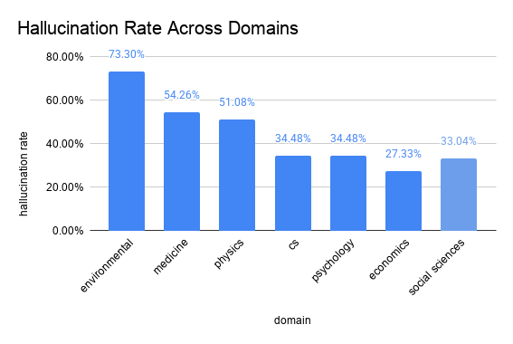
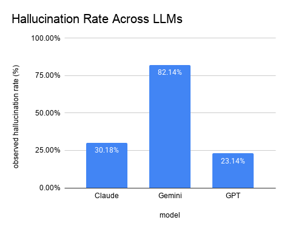
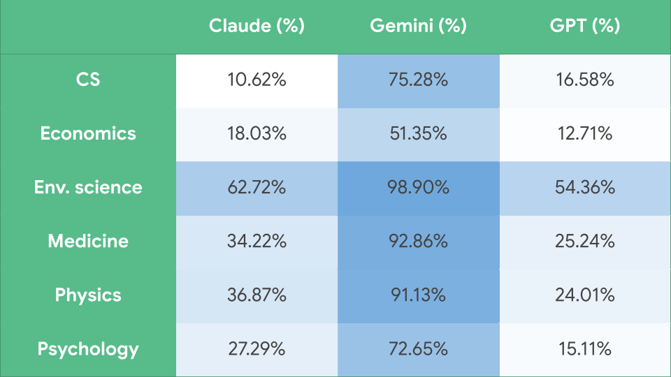
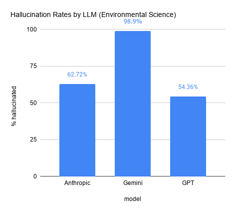

### Hallucination rate across domains  
Subdomains of psychology and economics are shown individually.  

  
  
### Graph of hallucination rate across LLMs  

  
  
### Heatmap of hallucination rates between LLMs and Domains  

  
  
### Hallucination rates by LLM in Environmental Science  

